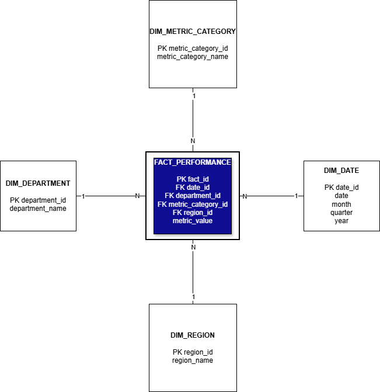

# BI Data Mart Project

## Data Model

The analytical structure of this project is based on a dimensional model using a star schema approach, a standard design in Business Intelligence for optimizing analytical queries and reporting.

### Grain Definition

Each record in the fact table represents the value of a specific KPI measured at a given point in time, for a particular department and region.

---

## Fact Table

### fact_performance

This table stores the measurable business indicators (KPIs).

| Column           | Description |
|------------------|------------|
| fact_id          | Unique identifier of the record |
| date_id          | Reference to the date dimension |
| department_id    | Reference to the organizational area |
| region_id        | Reference to the geographical region |
| metric_id        | Reference to the KPI being measured |
| metric_value     | Numerical value of the KPI |

---

## Dimension Tables

### dim_date

Provides the temporal context for analysis.

| Column   | Description |
|----------|------------|
| date_id  | Unique identifier of the date |
| date     | Full date |
| day      | Day of the month |
| month    | Month |
| quarter  | Quarter |
| year     | Year |

---

### dim_department

Represents organizational areas.

| Column           | Description |
|------------------|------------|
| department_id    | Unique identifier of the department |
| department_name  | Name of the department |

---

### dim_region

Represents geographical or organizational regions.

| Column     | Description |
|------------|------------|
| region_id  | Unique identifier of the region |
| region_name| Name of the region |

---

### dim_metric

Defines the specific KPIs being measured.

| Column              | Description |
|---------------------|------------|
| metric_id           | Unique identifier of the KPI |
| metric_name         | Name of the KPI (e.g., Revenue, Cost, Satisfaction) |
| metric_category_id  | Reference to the KPI category |
| metric_unit         | Unit of measurement (%, USD, count, etc.) |

---

### dim_metric_category

Groups KPIs into logical categories.

| Column                | Description |
|-----------------------|------------|
| metric_category_id    | Unique identifier of the category |
| metric_category_name  | Category name (e.g., Financial, Operational, Customer) |

---

## Relationships

The model follows a star schema with a normalized extension for KPI classification:

- fact_performance → dim_date  
- fact_performance → dim_department  
- fact_performance → dim_region  
- fact_performance → dim_metric  
- dim_metric → dim_metric_category  

This structure ensures data consistency, avoids redundancy, and supports flexible analytical queries.

---

## Analytical Capabilities

This model enables the analysis of organizational performance from multiple perspectives:

- Time-based analysis (trends, growth, seasonality)
- Performance comparison across departments
- Regional performance evaluation
- KPI-level analysis
- Category-level aggregation of metrics

---

## Data Model Visualization

The following diagram illustrates the structure of the data model:

